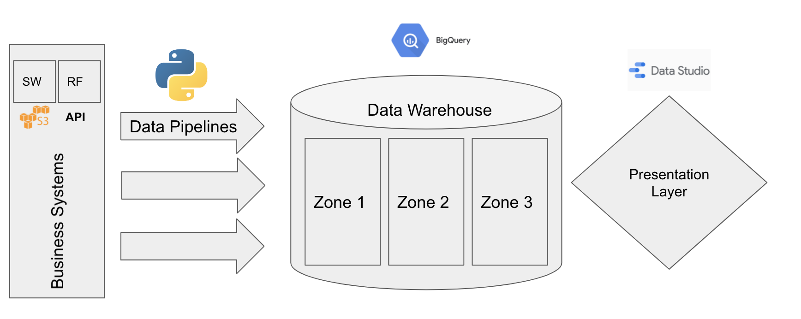

# recruitcloud

## Step 1

Run [load.py](https://github.com/dave-melillo/recruitcloud/blob/main/load.py)

## Step 2

Run [transformations.sql](https://github.com/dave-melillo/recruitcloud/blob/main/transformations.sql) in **BigQuery**

## Step 3

Replace data source in [DataStudio Dashboard](https://datastudio.google.com/s/qidK5SdPlCM)
